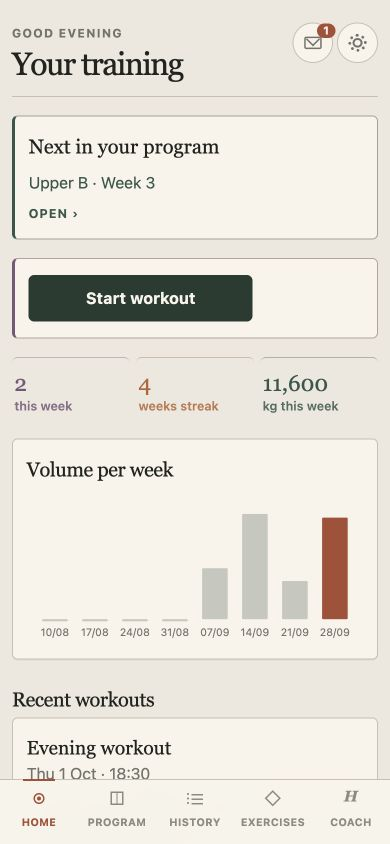
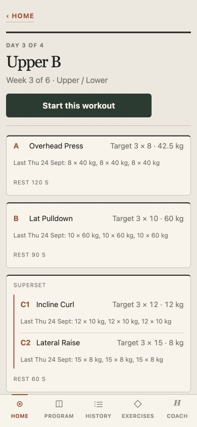
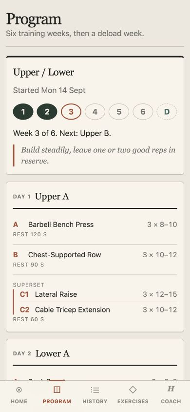
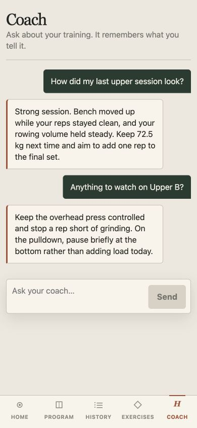

  

<h1 align="center">Coach</h1>

  A private, phone-first strength-training app with structured programs, offline logging and a coach that remembers.

## How it works

Coach keeps the training record in SQLite and uses clear progression rules to
choose the next session, target reps and load. Workouts can be logged without a
connection and sync when the phone is back online. Hermes handles conversation,
program changes and long-term coaching context.

## Screens

| Home | Today's workout |
| :---: | :---: |
|  |  |
| Program | Coach |
|  |  |

## Running it

The React PWA and FastAPI service run on a private host and are served to the
owner over Tailscale. See [deployment](docs/DEPLOY.md) for installation and
[development](docs/DEVELOPMENT.md) for the toolchain and quality checks.
